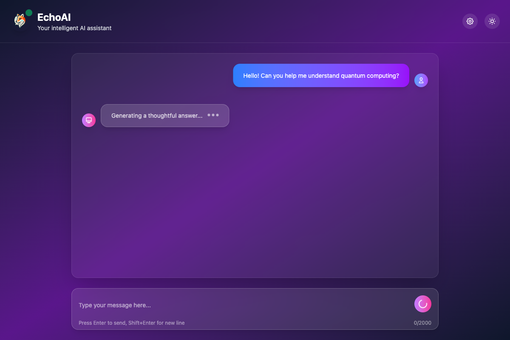
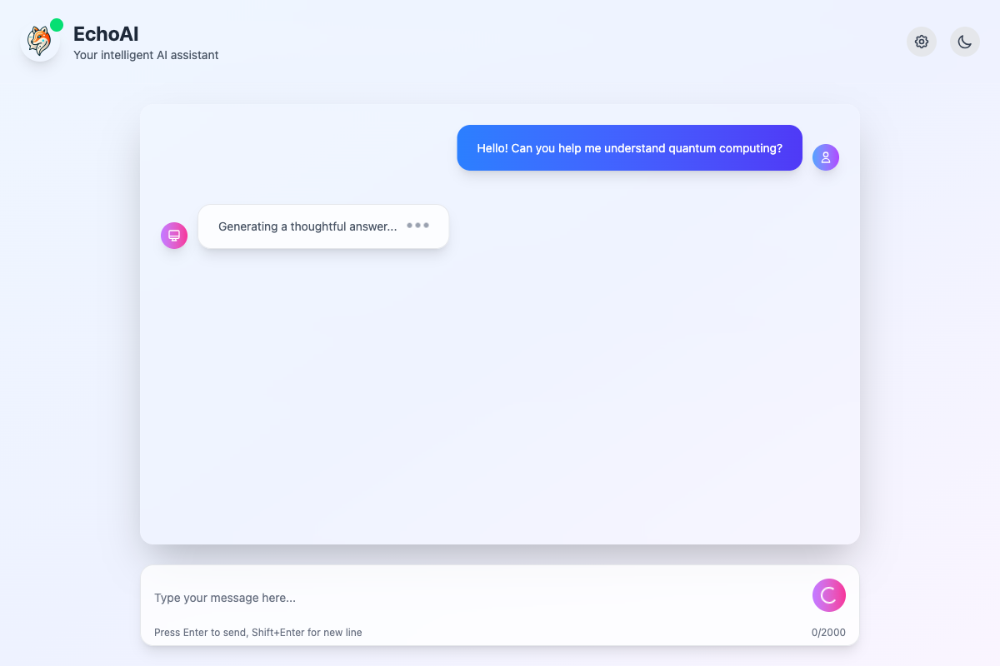
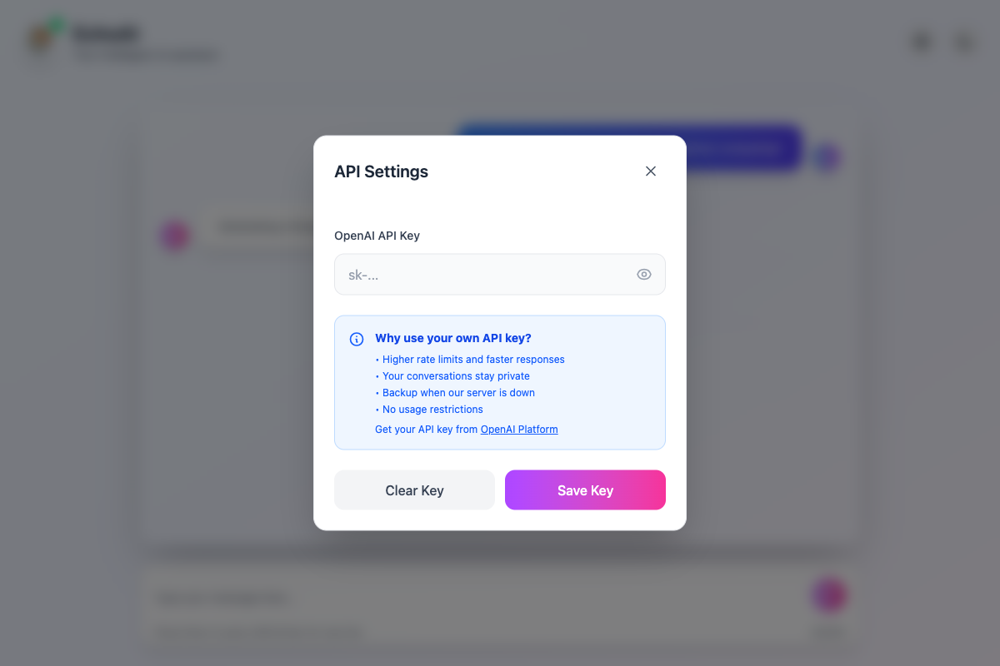

<div align="center">
  
  
  # EchoAI
  
  **A modern, responsive AI chat interface built with React, TypeScript, and OpenAI**
  
  <br>
  
  <!-- Badges -->
  <p align="center">
    <a href="https://github.com/droidbg/EchoAI">
      
    </a>
    <a href="https://github.com/droidbg/EchoAI/fork">
      
    </a>
    <a href="https://github.com/droidbg/EchoAI/issues">
      
    </a>
    <a href="https://github.com/droidbg/EchoAI/blob/main/LICENSE">
      
    </a>
  </p>
  
  <p align="center">
    <a href="https://nodejs.org/">
      
    </a>
    <a href="https://reactjs.org/">
      
    </a>
    <a href="https://www.typescriptlang.org/">
      
    </a>
    <a href="https://tailwindcss.com/">
      
    </a>
  </p>
  
  <p align="center">
    <a href="https://echoai2.vercel.app">
      
    </a>
    <a href="https://github.com/droidbg/EchoAI/discussions">
      
    </a>
  </p>
  
  <br>
  
  <!-- Quick Links -->
  <p align="center">
    <a href="#-features">Features</a> •
    <a href="#-quick-start">Quick Start</a> •
    <a href="#-installation">Installation</a> •
    <a href="#-deployment">Deployment</a> •
    <a href="#-contributing">Contributing</a>
  </p>
</div>

---

## 📱 Demo

<div align="center">
  
  ### 🖥️ Desktop View
  
  
  <br><br>
  
  ### 📱 Mobile View
  
  
  <br><br>
  
  ### 🎨 UI Screenshots
  
  <table>
    <tr>
      <td align="center">
        <strong>Light Mode</strong><br>
        
      </td>
      <td align="center">
        <strong>Dark Mode</strong><br>
        
      </td>
    </tr>
    <tr>
      <td align="center">
        <strong>Settings Modal</strong><br>
        
      </td>
      <td align="center">
        <strong>Error Handling</strong><br>
        
      </td>
    </tr>
  </table>
  
  <br>
  
  **[🚀 Try EchoAI Live](https://echoai2.vercel.app)** • **[📖 View Documentation](#-documentation)**
  
</div>

---

## 📊 Project Status

<div align="center">

| Status            | Description          |
| ----------------- | -------------------- |
| 🟢 **Stable**     | Production ready     |
| 🟢 **Active**     | Regular updates      |
| 🟢 **Maintained** | Bug fixes & features |
| 🟢 **Documented** | Comprehensive docs   |

</div>

### 🎯 Current Version: `v1.0.0`

- ✅ **Core Features**: Chat interface, API integration, error handling
- ✅ **UI/UX**: Dark/light mode, responsive design, animations
- ✅ **Security**: API key management, input validation
- ✅ **Performance**: Optimized builds, lazy loading
- 🔄 **Roadmap**: See [Issues](https://github.com/droidbg/EchoAI/issues) for upcoming features

---

## 🌟 Features

### 🎨 **Modern User Interface**

- **Responsive Design**: Works seamlessly on desktop, tablet, and mobile devices
- **Dark/Light Mode**: Toggle between beautiful dark and light themes
- **Glass Morphism**: Modern UI with backdrop blur effects and smooth animations
- **Accessibility**: Built with accessibility best practices in mind

### 🤖 **AI-Powered Conversations**

- **OpenAI Integration**: Powered by GPT-4 for intelligent, contextual responses
- **Smart Suggestions**: Pre-built prompts for common use cases
- **Context Awareness**: Maintains conversation context throughout the chat
- **Error Recovery**: Intelligent retry mechanisms with fallback options

### 🔐 **Flexible API Key Management**

- **User API Keys**: Use your own OpenAI API key for personal use
- **Server Fallback**: Built-in server with default API key for easy setup
- **Secure Storage**: API keys stored securely in browser local storage
- **Key Validation**: Real-time API key testing and validation

### ⚡ **Performance & Reliability**

- **Fast Loading**: Optimized bundle size and lazy loading
- **Error Handling**: Comprehensive error handling with user-friendly messages
- **Retry Logic**: Automatic retry mechanisms for failed requests
- **Offline Support**: Graceful degradation when offline

### 🛠️ **Developer Experience**

- **TypeScript**: Full type safety and excellent developer experience
- **Modern Stack**: React 18, Vite, Tailwind CSS, and more
- **Hot Reload**: Fast development with instant feedback
- **ESLint & Prettier**: Consistent code formatting and quality

---

## 📋 Table of Contents

<details>
<summary>Click to expand</summary>

- [📱 Demo](#-demo)
- [🌟 Features](#-features)
- [🚀 Quick Start](#-quick-start)
- [📦 Installation](#-installation)
- [⚙️ Configuration](#️-configuration)
- [💻 Usage](#-usage)
- [🏗️ Architecture](#️-architecture)
- [📚 API Documentation](#-api-documentation)
- [🚀 Deployment](#-deployment)
- [🤝 Contributing](#-contributing)
- [📄 License](#-license)
- [🙏 Acknowledgments](#-acknowledgments)
- [📞 Support](#-support)

</details>

---

## 🚀 Quick Start

> **⚡ Get up and running in under 5 minutes!**

### 📋 Prerequisites

| Requirement        | Version  | Download                                                |
| ------------------ | -------- | ------------------------------------------------------- |
| **Node.js**        | ≥ 16.0.0 | [Download](https://nodejs.org/)                         |
| **npm**            | Latest   | Included with Node.js                                   |
| **OpenAI API Key** | Any      | [Get Key](https://platform.openai.com/account/api-keys) |

### ⚡ One-Command Setup

```bash
# Clone, install, and start EchoAI
git clone https://github.com/droidbg/EchoAI.git && cd EchoAI && npm run setup
```

> **Note**: The `npm run setup` script will be added to automate the entire setup process.

### 1. Clone the Repository

```bash
git clone https://github.com/droidbg/EchoAI.git
cd EchoAI
```

### 2. Install Dependencies

```bash
# Install client dependencies
cd client
npm install

# Install server dependencies
cd ../server
npm install
```

### 3. Configure Environment

```bash
# Copy environment templates
cp client/.env.example client/.env
cp server/.env.example server/.env
```

Edit the environment files:

**`client/.env`:**

```env
VITE_SERVER_URL=http://localhost:3080/
```

**`server/.env`:**

```env
OPENAI_API_KEY=sk-your-openai-api-key-here
```

### 4. Start the Application

```bash
# Terminal 1: Start the server
cd server
npm start

# Terminal 2: Start the client
cd client
npm start
```

Visit `http://localhost:5173` to see EchoAI in action! 🎉

---

## 📦 Installation

### Option 1: Full Stack Setup (Recommended)

This setup includes both the React frontend and Node.js backend:

```bash
# Clone and setup
git clone https://github.com/droidbg/EchoAI.git
cd EchoAI

# Install all dependencies
npm run install:all

# Configure environment
cp client/.env.example client/.env
cp server/.env.example server/.env

# Start both client and server
npm run dev
```

### Option 2: Client-Only Setup

If you prefer to use your own backend or API:

```bash
# Clone and setup client only
git clone https://github.com/droidbg/EchoAI.git
cd EchoAI/client

# Install dependencies
npm install

# Configure environment
cp .env.example .env

# Start client
npm start
```

### Option 3: Server-Only Setup

For deploying just the backend:

```bash
# Clone and setup server only
git clone https://github.com/droidbg/EchoAI.git
cd EchoAI/server

# Install dependencies
npm install

# Configure environment
cp .env.example .env

# Start server
npm start
```

---

## ⚙️ Configuration

### Environment Variables

#### Client Configuration (`client/.env`)

| Variable          | Description        | Default                  | Required |
| ----------------- | ------------------ | ------------------------ | -------- |
| `VITE_SERVER_URL` | Backend server URL | `http://localhost:3080/` | Yes      |
| `VITE_DEBUG`      | Enable debug mode  | `false`                  | No       |

#### Server Configuration (`server/.env`)

| Variable         | Description         | Default       | Required        |
| ---------------- | ------------------- | ------------- | --------------- |
| `OPENAI_API_KEY` | Your OpenAI API key | -             | Yes             |
| `PORT`           | Server port         | `3080`        | No              |
| `NODE_ENV`       | Environment mode    | `development` | No              |
| `CLIENT_URL`     | Client URL for CORS | -             | No (production) |

### API Key Setup

#### Using Your Own API Key (Recommended)

1. **Get an OpenAI API Key**:

   - Visit [OpenAI Platform](https://platform.openai.com/account/api-keys)
   - Create a new API key
   - Copy the key (starts with `sk-` or `sk-proj-`)

2. **Add to EchoAI**:
   - Click the settings gear icon in the top-right corner
   - Paste your API key in the "Your OpenAI API Key" field
   - Click "Save Key"
   - The system will test your key automatically

#### Using Server API Key

1. **Add to Server Environment**:

   ```bash
   # In server/.env
   OPENAI_API_KEY=sk-your-openai-api-key-here
   ```

2. **Restart the Server**:
   ```bash
   cd server
   npm start
   ```

---

## 💻 Usage

### Basic Chat

1. **Start a Conversation**: Type your message in the input field
2. **Send Message**: Press Enter or click the send button
3. **View Response**: The AI response will appear in the chat
4. **Continue Chatting**: Keep the conversation going naturally

### Using Suggestions

EchoAI provides helpful suggestions to get you started:

- **"Explain quantum computing"** - Get explanations of complex topics
- **"Write a creative story"** - Generate creative content
- **"Help with coding"** - Get programming assistance
- **"Plan a vacation"** - Get travel planning help

### Error Handling

When errors occur, EchoAI provides helpful options:

- **Try Again**: Retry the failed request
- **Use Your API Key**: Switch to your personal API key
- **Clear Error**: Dismiss the error and continue

### Settings

Access settings by clicking the gear icon:

- **API Key Management**: Add, test, or remove your API key
- **Theme Toggle**: Switch between dark and light modes
- **Key Status**: See which API key is currently active

---

## 🏗️ Architecture

### Frontend (React + TypeScript)

```
client/
├── src/
│   ├── components/          # React components
│   │   ├── AiChat.tsx      # AI message display
│   │   ├── ChatBody.tsx    # Main chat container
│   │   ├── ChatInput.tsx   # Message input
│   │   ├── SettingsModal.tsx # Settings interface
│   │   ├── TypingIndicator.tsx # Loading animation
│   │   └── UserChat.tsx    # User message display
│   ├── utils/              # Utility functions
│   │   ├── Api.ts          # API communication
│   │   └── ApiKeyManager.ts # API key management
│   ├── App.tsx             # Main application
│   └── main.tsx            # Application entry point
├── public/                 # Static assets
└── package.json           # Dependencies and scripts
```

### Backend (Node.js + Express)

```
server/
├── index.js               # Main server file
├── package.json          # Dependencies and scripts
├── vercel.json           # Vercel deployment config
└── .env.example          # Environment template
```

### Technology Stack

#### Frontend

- **React 18** - Modern React with hooks and concurrent features
- **TypeScript** - Type-safe JavaScript development
- **Vite** - Fast build tool and development server
- **Tailwind CSS** - Utility-first CSS framework
- **React Query** - Data fetching and state management
- **Auto Animate** - Smooth animations

#### Backend

- **Node.js** - JavaScript runtime
- **Express** - Web application framework
- **OpenAI SDK** - Official OpenAI API client
- **CORS** - Cross-origin resource sharing
- **dotenv** - Environment variable management

---

## 📚 API Documentation

### Server Endpoints

#### Health Check

```http
GET /
```

**Response:**

```json
{
  "status": "healthy",
  "service": "EchoAI Server",
  "version": "1.0.0",
  "timestamp": "2024-12-19T10:30:00.000Z",
  "environment": "development"
}
```

#### Chat Completion

```http
POST /
Content-Type: application/json

{
  "message": "Hello, how are you?"
}
```

**Response:**

```json
{
  "message": "Hello! I'm doing well, thank you for asking. How can I help you today?",
  "usage": {
    "prompt_tokens": 10,
    "completion_tokens": 20,
    "total_tokens": 30
  },
  "model": "gpt-4o-mini"
}
```

**Error Responses:**

| Status | Error                 | Description                |
| ------ | --------------------- | -------------------------- |
| 400    | Invalid request       | Missing or invalid message |
| 401    | Invalid API key       | OpenAI API key is invalid  |
| 402    | Insufficient quota    | OpenAI API quota exceeded  |
| 429    | Rate limit exceeded   | Too many requests          |
| 500    | Internal server error | Server-side error          |

### Client API

#### Message Type

```typescript
interface Message {
  sender: 'user' | 'ai';
  message: string;
  isError?: boolean;
  errorId?: string;
}
```

#### API Functions

```typescript
// Fetch AI response
fetchResponse(messages: Message[]): Promise<{ message: string }>

// API Key Management
ApiKeyManager.getApiKey(): string | null
ApiKeyManager.setApiKey(key: string): void
ApiKeyManager.clearApiKey(): void
ApiKeyManager.validateApiKeyFormat(key: string): { isValid: boolean; message: string }
ApiKeyManager.testApiKey(key: string): Promise<{ isValid: boolean; message: string }>
```

---

## 🚀 Deployment

### Option 1: Vercel (Recommended)

#### Deploy Client

```bash
# Install Vercel CLI
npm i -g vercel

# Deploy client
cd client
vercel

# Follow the prompts to configure
```

#### Deploy Server

```bash
# Deploy server
cd server
vercel

# Add environment variables in Vercel dashboard
# OPENAI_API_KEY=your-key-here
```

### Option 2: Railway

#### Deploy Full Stack

```bash
# Install Railway CLI
npm i -g @railway/cli

# Login and deploy
railway login
railway init
railway up
```

### Option 3: Self-Hosted

#### Using Docker

```dockerfile
# Dockerfile for server
FROM node:18-alpine
WORKDIR /app
COPY server/package*.json ./
RUN npm ci --only=production
COPY server/ .
EXPOSE 3080
CMD ["npm", "start"]
```

#### Using PM2

```bash
# Install PM2
npm i -g pm2

# Start server with PM2
cd server
pm2 start index.js --name echoai-server
pm2 startup
pm2 save
```

### Environment Variables for Production

```bash
# Server
OPENAI_API_KEY=sk-your-production-key
NODE_ENV=production
PORT=3080
CLIENT_URL=https://your-client-domain.com

# Client
VITE_SERVER_URL=https://your-server-domain.com
```

---

## 🤝 Contributing

We welcome contributions to EchoAI! Please see our [Contributing Guide](CONTRIBUTING.md) for details.

### Quick Contribution Guide

1. **Fork the repository**
2. **Create a feature branch**: `git checkout -b feature/amazing-feature`
3. **Make your changes** and test them
4. **Commit your changes**: `git commit -m 'Add amazing feature'`
5. **Push to the branch**: `git push origin feature/amazing-feature`
6. **Open a Pull Request**

### Development Setup

```bash
# Fork and clone
git clone https://github.com/droidbg/EchoAI.git
cd EchoAI

# Install dependencies
npm run install:all

# Start development servers
npm run dev
```

### Code Style

- Use TypeScript for all new code
- Follow ESLint and Prettier configurations
- Add JSDoc comments for complex functions
- Write meaningful commit messages
- Test your changes thoroughly

---

## 📄 License

This project is licensed under the Apache License 2.0 - see the [LICENSE](LICENSE) file for details.

## 🙏 Acknowledgments

- **OpenAI** for providing the amazing GPT models
- **React Team** for the excellent framework
- **Vercel** for the deployment platform
- **All Contributors** who help make EchoAI better

---

## 📞 Support

- **Documentation**: [GitHub Wiki](https://github.com/droidbg/EchoAI/wiki)
- **Issues**: [GitHub Issues](https://github.com/droidbg/EchoAI/issues)
- **Discussions**: [GitHub Discussions](https://github.com/droidbg/EchoAI/discussions)
- **Security**: [Security Policy](SECURITY.md)

---

<div align="center">
  <p>Made with ❤️ by the EchoAI Contributors</p>
  <p>
    <a href="https://github.com/droidbg/EchoAI">⭐ Star us on GitHub</a> •
    <a href="https://github.com/droidbg/EchoAI/issues">🐛 Report Bug</a> •
    <a href="https://github.com/droidbg/EchoAI/issues">💡 Request Feature</a>
  </p>
</div>
