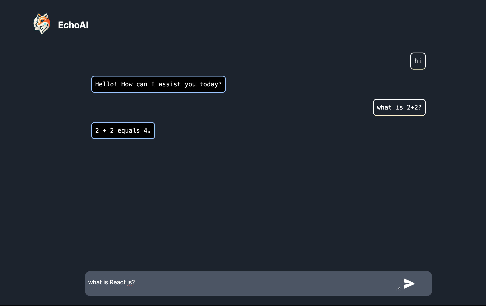

<p align="center"></p>
<p align="center"> </p>

<h3 align="center">  EchoAI - Smooth & responsive AI assistant 💬 (React, Nodejs and OpenAI)!</h3>


🚀 EchoAI is a React based intelligent conversations with OpenAI..

Hosted **on [echoai2.vercel.app](https://echoai2.vercel.app/),** this application brings a hassle-free way to chat with openAI.


# Docs

- [Example](#example)
- [Features](#-features)

- [Tech Stack](#-tech-stack)
- [Live Demo](#-live-demo)
- [Project Local Setup](#-project-local-setup)
- [Contributing](#-contributing)
- [License](#-license)


## Example

<p align="center">
<a href="https://zonion.vercel.app">

</a>
</p>

## 🌟 Features

- Interactive and responsive chat interface.
- Seamless integration with OpenAI API for natural language responses.
- Simple and clean UI design.
- Lightweight and fast.

## 📂 Project Local Setup

### Prerequisites

- Node.js (v16 or above recommended)
- OpenAI API Key (Sign up at [OpenAI](https://openai.com/) to obtain an API key)

### Installation

1. Clone this repository:

```bash
git clone https://github.com/droidbg/chatgpt2.0.git
cd chatgpt2.0
```

2. Install dependencies:

- In the `client folder`

  ```bash
  cd client
  npm install
  ```

- In the `server folder`

  ```bash
  cd server
  npm install

  ```

3. Set up environment variables:

   - Create a `.env` file in the `client` folder of the project and add the following:

   ```env
   VITE_SERVER_URL="http://localhost:3080/"
   ```

   - Create a `.env` file in the `server` folder of the project and add the following:

   ```env
   OPENAI_API_KEY="sk-********-******"
   ```

   Replace OPENAI_API_KEY with your Open AI Key.

4. Start the development server and client server using command in both `client` and `server` folder:

   ```bash
   npm start
   ```

   The application will run at `http://localhost:3000` or `http://localhost:5173/`.

## Usage

1. Open the application in your browser.
2. Type a query into the chat input box.
3. Press enter or click the send button to receive a response generated by OpenAI's API.

```

## Technologies Used

- React.js
- Nodejs
- OpenAI API Integration
- Tailwind


## Contributing

Contributions are welcome! Feel free to fork the repository and submit a pull request with your improvements or fixes.


```
